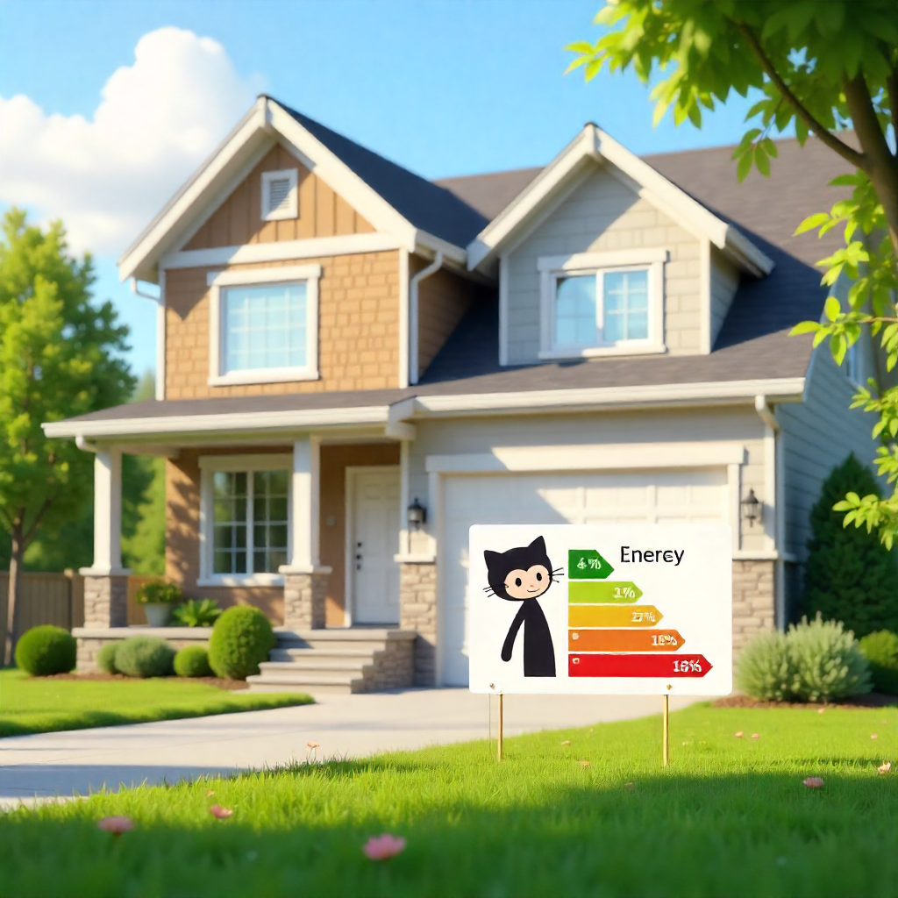

# 🌿 Certweb – Energy Certificate Platform

 <!-- Replace with your own screenshot -->

  
  
  
  
  
  

**Certweb** is a web application built with **Django** that allows users to request **energy certificates** quickly and professionally.  
The project showcases my skills as a **Mechanical Engineer** and full-stack developer with **Python/Django**, including responsive frontend design and a working contact form with email integration.

---

## 💻 Tech Stack

- **Backend:** Django 5.2  
- **Frontend:** HTML5, CSS3 (Bootstrap 5), JavaScript  
- **Database:** MySQL  
- **Email integration:** Django `send_mail` (console backend for development, SMTP for production)  
- **Version control:** Git / GitHub  

---

## 📂 Project Structure
Certweb/
├── Certweb/ # Django project settings
├── CertwebAPP/ # Main app (Home, Services, About)
├── ContactAPP/ # Contact form app (forms, email sending)
├── static/ # CSS, images, JS
└── templates/ # HTML templates

---

## 🚀 Features

1. **Landing page** with services and about section.  
2. **Functional contact form** with email sending:  
   - Sends user data (Name, Email, Phone, Address, Message).  
   - In development, emails are printed to the console.  
   - In production, emails are sent via Gmail SMTP.  
3. **Services page** highlighting the value of energy certificates.  
4. **Responsive design** (mobile & tablet friendly).  
5. **Navigation bar and footer** styled with modern CSS.  
6. **MySQL integration** for scalable data storage.  

---

## 📸 Screenshots

### Home

### Services

### Contact Form

### Thank You Page

---

## ⚙️ Installation

Follow these steps to get the project running locally:

1️⃣ **Clone the repository**: `git clone https://github.com/Ismaelardoy/cert-web.git` and enter the project folder: `cd cert-web`.  
2️⃣ **Install dependencies**: `pipenv install`.  
3️⃣ **Activate the virtual environment**: `pipenv shell`.  
4️⃣ **Configure the database** in `settings.py` (MySQL by default, or SQLite for testing).  
5️⃣ **Set up email credentials**: create a `.env` file in the project root with the following:

EMAIL_HOST=smtp.gmail.com  
EMAIL_PORT=587  
EMAIL_USE_TLS=True  
EMAIL_HOST_USER=your_email@gmail.com  
EMAIL_HOST_PASSWORD=your_app_password  
DEFAULT_FROM_EMAIL="Certificados Energéticos <your_email@gmail.com>"

6️⃣ **Run migrations**: `python manage.py migrate`.  
7️⃣ **Start the development server**: `python manage.py runserver`.  
8️⃣ **Open the app** in your browser at [http://127.0.0.1:8000/](http://127.0.0.1:8000/).
